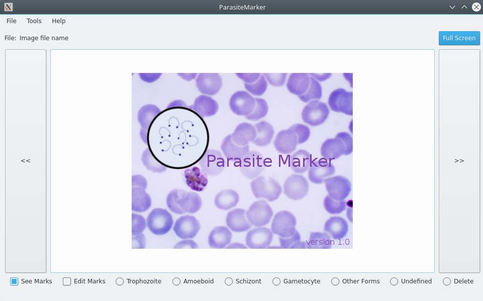

# ParasiteMarker

**ParasiteMarker** is an aplication to easy mark Malaria parasites.
  The software is being used to mark Malaria parasites in Malaria CETELI database  (UNRELEASED). This software born from **BacillusMarker v1.0** (https://github.com/fperdigon/BacillusMarker)
   email:<Francisco Perdigón Romero> fperdigon88@gmail.com

#### Features

- Annotation of Malaria parasite.
- System of authentication and registry of annotations by users.
- Full screen image.
- Save annotations to CVS files (no need to generate a new image).
- Save annotations to BMP files (new BMP image with marks).
- Counting parasites in a tail region. This option create a CSV file with the number of parasites by image and total of parasites in a tail region.

#### Dependencies

- Python2.7
- PySide (any version for Qt4)
- Qt4

#### Operational System

- Linux
- Windows
- MacOS

#### Support

Universidade Federal do Amazonas, Brasil (UFAM).
 http://www.ufam.edu.br/
  Centro de Pesquisa e Desenvolvimento em Tecnologia Eletrônica e da Informação (CETELI).
 http://www.ceteli.ufam.edu.br/
  Instituto Nacional de Pesquisa da Amazonia (INPA).
 http://portal.inpa.gov.br/

#### License

MIT License

Copyright (c) 2017 Francisco Perdigón Romero

Permission is hereby granted, free of charge, to any person obtaining a copy
of this software and associated documentation files (the "Software"), to deal
in the Software without restriction, including without limitation the rights
to use, copy, modify, merge, publish, distribute, sublicense, and/or sell
copies of the Software, and to permit persons to whom the Software is
furnished to do so, subject to the following conditions:

The above copyright notice and this permission notice shall be included in all
copies or substantial portions of the Software.

THE SOFTWARE IS PROVIDED "AS IS", WITHOUT WARRANTY OF ANY KIND, EXPRESS OR
IMPLIED, INCLUDING BUT NOT LIMITED TO THE WARRANTIES OF MERCHANTABILITY,
FITNESS FOR A PARTICULAR PURPOSE AND NONINFRINGEMENT. IN NO EVENT SHALL THE
AUTHORS OR COPYRIGHT HOLDERS BE LIABLE FOR ANY CLAIM, DAMAGES OR OTHER
LIABILITY, WHETHER IN AN ACTION OF CONTRACT, TORT OR OTHERWISE, ARISING FROM,
OUT OF OR IN CONNECTION WITH THE SOFTWARE OR THE USE OR OTHER DEALINGS IN THE
SOFTWARE.